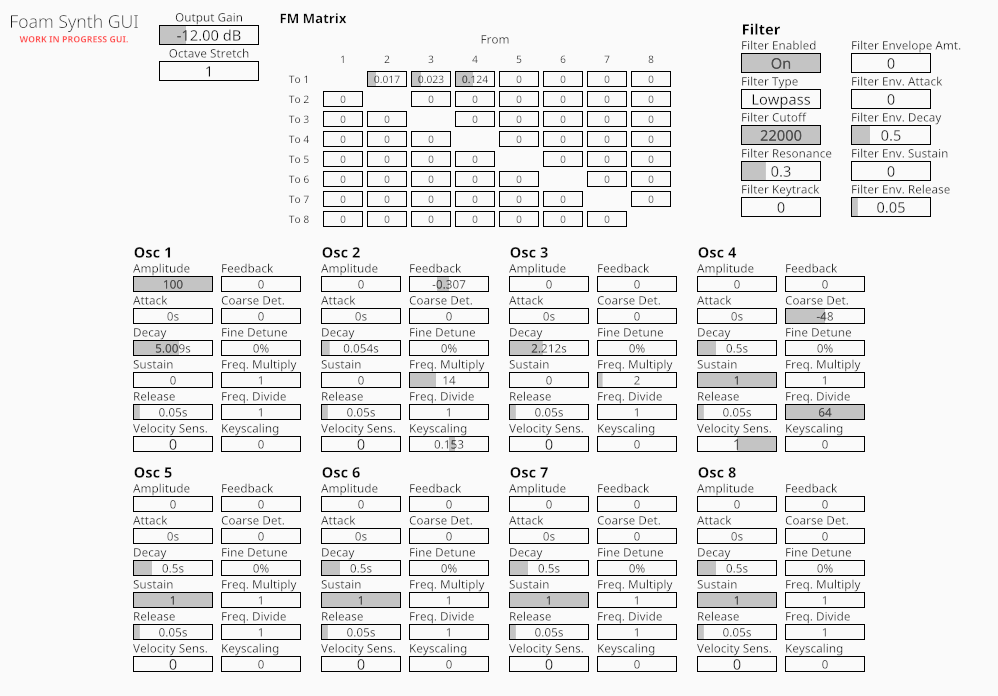

# Foam


8 operator FM synth with a cross-oscillator modulation matrix, available in VST3 and CLAP plugin formats. Oscillator generation and modulation is SIMD accelerated (via [wide](https://github.com/lokathor/wide)).

Open source under GPLv3.

In development, control ranges and such may change between versions, potentially breaking your presets/saved projects on update. Also, the CLAP version has not been tested yet (though it should still work, file an issue if it doesn't!)

Downloads [available at the releases page](https://github.com/Madadog/foam-synth/releases).

## What

There are 8 feedback-capable sine oscillators, each with independent amplitude envelopes. Each of the 8 oscillators has the following controls:
* **Amp:** Direct output volume (post-modulation, doesn't affect modulation of other oscillators)
* **Feedback:** Oscillator tone/self-PM. Positive values tend towards a saw wave, negative values towards a square wave.
* **Frequency Controls:**
    * **Coarse:** Frequency shift in semitones
    * **Fine:** Frequency shift in cents
    * **Frequency Multiply:** Multiplies frequency by an integer value from 1-64
    * **Frequency Divide:** Divides frequency by an integer value from 1-64
* **Envelope controls: (affects modulation)**
    * **Attack:** Envelope attack time. How long it takes to reach maximum volume after note start.
    * **Decay:** Envelope decay time. How long it takes for the volume to descend to the sustain level after attack time.
    * **Sustain:** Envelope sustain level. Sustained volume level after decay stage but before note release.
    * **Release:** Envelope release time. Time note continues playing after note release.
    * Note: The decay and release stages are exponential, not linear. 
* **Misc. Controls**
    * **Velocity Sensitivity:** How much MIDI velocity affects oscillator volume.
    * **Keyscaling:** How oscillator volume decreases/increases as pitch rises/falls.

The oscillators modulate each other via a 8x7 matrix, where every oscillator is connected to every other one (excluding itself, since feedback is a separate control with a greater range). It is possible to create cross-oscillator feedback loops (e.g. Osc1 and Osc2 both modulate each other) but they don't typically sound that good (not that I'm stopping you). The matrix is implemented by enforcing a 1-sample delay between oscillators.

There is also a polyphonic multimode filter (Simper SVF), controllable via an ADSR envelope.

Technically this is a PM synth, but the terms PM/FM are often used interchangeably. If you want a classic modular-style (exponential-pitch) FM synth, it can be set up in [Cardinal](https://github.com/DISTRHO/Cardinal) (though it sounds metallic and is difficult to tune).

## Controls

Click and drag to adjust slider values. Double click to reset to default. SHIFT+drag for fine adjustments. Right-click or CTRL+click to type values in.

## Why

Made for fun. This is basically a [Dexed](https://github.com/asb2m10/dexed) clone, except:

* Build-your-own algorithm with the FM matrix
* Feedback on every oscillator
* 32-bit floating point for all audio

## Building

After installing [Rust](https://rustup.rs/), you can compile Foam as follows:

```shell
cargo xtask bundle foam --release
```

## Credits
Thanks to [Surge XT](https://github.com/surge-synthesizer/surge) (and its developers) for the +/- FM feedback algorithm.

Thanks to [NIH-plug](https://github.com/robbert-vdh/nih-plug) for being a great plugin framework.

Thanks to [Codeium](https://codeium.com/) for filling out a lot of the boilerplate which would have been a pain to do manually (mostly plugin parameters).

## License

This project and all its files are licensed under the GPLv3 license.

The following file/s are additionally available under the ISC license (indicated in the file header)
* src/editor/param_slider.rs

## TODO:

* DSP:
    * Add panning
    * Add envelope Delay and Hold
    * Control for envelope final release level
    * Envelope slope controls?
    * Precalculate table for tuning approximation?
    * Add pitch bend control
    * Add phase control
    * Hertz-based detune
    * Add LFO and pitch envelope
    * Make filter envelope independent of host block size
    * Add global volume envelope
    * Toggle oscillators on/off
    * Make filter keytracking actually work
    * Allow use of the filter in FM modulation
    * +/- FM modulation for all controls
    * RM modulation
    * Oscillator sync
    * Legato, portamento
    * Add noise source somewhere
    * OPL2 waveform select
    * Allow picking keyscaling root key
    * Scala support?
    * 8/16/24 bit integer FM calcs from Dexed? (for speed)
    * Optimize
        * Enforce a minimum (constant?) block size

* GUI:
    * Add feedback, amplitude & filter send to matrix
    * Visualize envelopes & their settings
    * Dark theme
    * Oscilloscope / spectrogram

* Code:
    * Use more constants for GUI dimensions

* Lofty Wishlist
    * Oversampling
    * Oscillator wavetables
    * MSEG modulators
    * Modulation of all parameters
    * Optional audio-rate/block-rate modulation
    * Effects
    * FM from/to sample player oscillator
    * 2 filters, more filter types.
    * Resizable GUI
    * Good presets
    * Add/remove oscillators
    
og pitch + matrix -> phase (0-1) -> phaseshaper (0-1) -> wave -> waveshaper -> matrix -> effects -> out

phaseshapers: powf, mseg, squeeze, sync, quantize, 
waveshapers: powf, mseg, asymmetric powf, linear fold, sine fold, linear wrap, 
effects: distortion, chorus, flanger, phaser, delay, reverb, compressor, eq, filter
